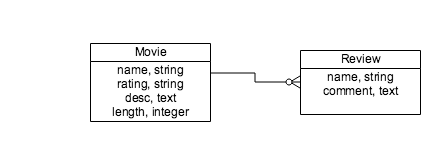

## Objectives
* Use the `resources` method in the routes file to generate all the routes.
* Model a Movie and Review relationship.
* Implement the Review and it's association to a Movie.
* Create Movies and Reviews in the Rails console.
* Explore how the DB implements these relationships.
* Explore how Rails implements these relationships.

## We Do: Setup

**Make sure you fork, clone, create the DB, migrate and seed the DB.**

```
rake db:create
rake db:migrate
rake db:seed
```

**Run the server**

```
rails server
```

Ok, you should now be able to see the JSON for all three movies at `http://localhost:3000` and the JSON for the movie "Mad Max" at `http://localhost:3000/movies/2`

**Do we all understand how the JSON is served up to us?If not, let's look at the Route, Controller and Model for Movies.** 

## We Do: Create movies routes using 'resources'

Previously, we were *explicitly* creating routes for each Movie Controller action. *This is tedious.* Let's see how we can make this more concise.

**But, first lets look at all of routes!**

```
rake routes
```

**Change config/routes to**

```ruby
Rails.application.routes.draw do
  # Default root for '/' in this application                                    
  root 'movies#index'

  # create routes for movie resource                                            
  resources :movies, except: [:new, :edit]
end
```

The 'resources' method will automatically generate all the routes we've been creating individually. *Much better.*

**In another terminal run rake routes again and compare the routes.**

```
rake routes
```

## Data Modelling

Data Modelling is a field in and of itself. We'll not dive into the this very deep. A common way to create data models is to use [Crows Foot Notation](http://www.codeproject.com/Articles/878359/Data-modelling-using-ERD-with-Crow-Foot-Notation) to create a Entity Relationship Diagram(ERD).

We'll use a subset of Crows Foot Notation to diagram relationships between Models/Entities.




One Movie has many Reviews. There is a a one to many relationship between Movie and Review.

## Active Record Associations


As the above data model indicates there is a relationship/association between the Movie and Review models. The Movie model **has many** reviews and a review **belongs to** a movie. 

These **has many** and **belongs to** relationships/associations are implemented in the database by using **foreign keys**. And they are implemented in ActiveRecord Models by using **belongs_to** and **has_many** associations. [See Active Record Associations](http://guides.rubyonrails.org/association_basics.html)

### Terminology

In the above relationship we often say that there is a **parent-child** relationship. In this case **Movie is the parent and Review is the child.**

Also, we'll say that Movie has a **collection** of reviews. And that there is a **one to many** association between these two entities. **One Movie will have many Reviews**.


## We Do: Create a Review Model

Lets use a rails generator to create the Review Model. This will also create a migration for this Review Model.

**Create the Review Model and Migration and apply the migration**

```bash
$ rails g model Review name:string comment:text movie:references
$ rake db:migrate
```

**Open up the migration generated**

This will show ,for us, a new kind of column. A column that will contain the **foreign key** to a movie.

```ruby
  ...
  t.references :movie, index: true, foreign_key: true
  ...
```

This will create a **foreign key** column in the reviews table. 

The **foreign key** column will contain the id of movie that the review pertains to. 

Another words, the movie "Affliction" has an id of 1. If we create a review for this movie then the row in reviews table will have a **foreign key** column, named *movie_id*, with a value of 1.

**Open up the Rails DB console and take a look at the tables we now have**

```
rails db

\dt
\d movies
\d reviews
```

The `\d` will show all the tables.

 `\dt movies` and `\dt reviews` will show the columns for movies and reviews tables. 
 
*Notice that the reviews table now has a movie_id column. This is the foreign key that references a specific movie by it's id.*

**Open up the db/schema.rb**

And see that the 'reviews' table has a entry 'movie_id' that is the **foreign key**.

## I Do: Create a DB Diagram.

I'll create a diagram, aka **Physical Model**, of the database. This will show each **table**, each **table's columns** and the **values of the rows**.

When we add reviews you'll see how the rows in the reviews table relate to rows in the movies table.

## We Do: Create a Movie Review.

**Open the app/models/review.rb**

Notice the **belongs_to** method in the Review Model. This will create a relationship from the review to the movie that the review pertains to.

**The belongs_to method ALWAYS lives on the model that has a the foreign key!**

**Add this to the app/models/movies.rb**

```
has_many :reviews
```

The *has_many* method will create a relationship from the Movie Model to the Review model.

Notice how the language matches the relationships. A movie may **have many** reviews. And a review **belongs to** one movie.

Now we have a **one to many** relationship between movie and reviews.

**Let's create a moview review in Rails console.**

```
rails c
m1 = Movie.first
m1.reviews

```

Notice, a movie now has the reviews method! The **has_many** added this reviews method to the Movie Model. 

*This works somewhat like the `attr_accessor` method in a Ruby class. `attr_accessor` adds a two methods to the Ruby class.*


```
Review.all

m1.reviews.create(name: 'Tom', comment: 'Dark, somber')

r1 = Review.first

m1.reviews
```

First we see that there are no Reviews when we run `Review.all`. 

Then we create a review for the movie 'Affliction' with `m1.reviews.create(name: 'Tom', comment: 'Dark, somber')`. 

Then we get the one and only review at this time in the DB with the `r1 = Review.first`. 

Then we show all the movie, 'Affliction', reviews, `m1.reviews`. This will generate a SQL SELECT to find all the reviews for the movie 'Affliction'.

```sql
SELECT "reviews".* FROM "reviews" WHERE "reviews"."movie_id" = $1  [["movie_id", 1]]
```

**Open up the rails db console and run the follow SQL**

```
SELECT * FROM reviews;
SELECT * FROM reviews WHERE reviews.movie_id = 1;
```

See how `m1.reviews` generates and runs the SQL to find all the movie, m1, reviews.

**Let's draw what the movies and reviews tables in the DB look like at this time**

**Let's confirm our drawing by using rails db**

```
rails db

SELECT * FROM reviews;

SELECT * FROM movies;
```

See how the movie_id in the reviews column has the value 1. This is the id of the movie that the review is for.


## You Do: Create a Album with Songs.
> Work in Groups to create:  

* An Album that will have a title, artist name, released year.

* A Song that will have a title, duration and price.

* An Album that may have many Songs.

* A Song that belongs to an Album.

> In the Rails console. 

* Create an Album.
* Find and create a variable for this Album.
* Create a couple of songs for this Album using this album's songs method.
* Show all the Albums.
* Show all the Songs.

* Repeat the above for a second album that has a couple of songs.

> Using psql: `$ rails db`

* Show all the Albums.
* Show all the Songs.
* Show all the first album's songs. *Hint, you can find the SQL from running `album1.songs` in the rails console.*

> Draw the physical model for the album and songs table. Don't forget to draw each row's content!


## We Do: Populate Movie Reviews

**Add to the seed file**

```
Review.delete_all
Movie.delete_all

movie = Movie.create!(name: 'Affliction', rating: 'R', desc: 'Little Dark', length: 123)
movie.reviews.create!(name: 'Tom', comment: 'Dark, somber')
movie.reviews.create!(name: 'Meg', comment: 'Slow, boring')

movie = Movie.create!(name: 'Mad Max', rating: 'R', desc: 'Fun, action', length: 154)
movie.reviews.create!(name: 'Joe', comment: 'Explosions, silly')
movie.reviews.create!(name: 'Christine', comment: 'Brilliant, fun')

movie = Movie.create!(name: 'Rushmore', rating: 'PG-13', desc: 'Quirky humor', length: 105)
movie.reviews.create!(name: 'Tom', comment: 'Crazy, humor')
movie.reviews.create!(name: 'Joanne', comment: 'Waste of time, stupid')

puts "Created three Movies"
```

## I Do: 

Draw the movies and review DB tables and their contents.

## You Do: 

> Populate the DB with Albums and Songs. *In the db/seed.rb file.*  

> Draw, as a group, the DB tables for Albums and Songs. Each table should have a row for each Album and Song. (Don't forget to show the foreign keys!)

## We Do: Rails, `has_many`


Including `has_many` in an ActiveRecord model defines a series of methods on the model for accessing an associated **collection** of objects. For example, if we have a `Movie` model and include `has_many :reviews`, we will be able to get a particular Movie's entire set of reviews by `Movie.find(1).reviews`.

Just like `attr_accessor`, `has_many` is a macro that defines methods for us. You can think of the methods it defines as specialized setters and getters, as well as additional methods for dealing with database records. A list of all the methods generated by `has_many` can be found in the [ActiveRecord::Associations::ClassMethods documentation](http://api.rubyonrails.org/classes/ActiveRecord/Associations/ClassMethods.html#method-i-has_many).

Supposing a `Movie` that `has_many :reviews`, the list of generated methods is:


1. `Movie#reviews`  
1. `Movie#reviews<<`  
1. `Movie#reviews.delete`  
1. `Movie#reviews.destroy`  
1. `Movie#reviews=`  
1. `Movie#review_ids`  
1. `Movie#review_ids=`  
1. `Movie#reviews.clear`  
1. `Movie#reviews.empty?`  
1. `Movie#reviews.size`  
1. `Movie#reviews.find`  
1. `Movie#reviews.exists?(name: 'ACME')`  
1. `Movie#reviews.build`  
1. `Movie#reviews.create`  
1. `Movie#reviews.create!`  

We used the `Movie#reviews` method when we ran `m1.reviews` in the rails console above. 

We used the `Movie#reviews.create` method when we ran  `m1.reviews.create(name: 'Tom', comment: 'Dark, somber')` in the rails console above.

## You Do: `has_many` Methods

> Each member of your group will:

* Research one method generated by `has_many`.  
* Describe what the method does in your own words.  
* Is it a setter, a getter, or something else?  
* Then, give an example of another one-to-many  relationship, where you would define `has_many`, and how you would use the method you just researched.  

## We Do: Rails, `belongs_to`


Including `belongs_to` in an ActiveRecord model defines a series of methods on the model for accessing a **single** associated object. For example:  

> Open the `$ rails console`

```ruby
> r1 = Review.first
> r1.movie
=> SELECT  "movies".* FROM "movies" WHERE "movies"."id" = $1 LIMIT 1  [["id", 1]]
```

The **belongs_to** will create the `movie` method that will generate and run a SQL SELECT statement to find the Movie that r1 review belongs to.

The "children" in parent-child relationships, or the "many" in one-to-many relationships holds the foreign key, and therefore will need `belongs_to` on the ActiveRecord model.

`belongs_to` defines several methods for us. A list of the methods generated by `belongs_to` can be found in the [ActiveRecord::Associations::ClassMethods documentation](http://api.rubyonrails.org/classes/ActiveRecord/Associations/ClassMethods.html#method-i-belongs_to)

If a Review model has a `belongs_to :movie`, the list of generated methods is:  

1. `Review#movie`  
1. `Review#movie=(movie)`  
1. `Review#build_movie`  
1. `Review#create_movie`  
1. `Review#create_review!`  

Other than the first method above, `Review#movie` we won't typically be using these methods. As we'll see, reviews are typically added to movies by using the `Movie#reviews` method.

## We Do: Where to put `has_many` and `belongs_to`  

How do you decide where to put the `has_many` and `belongs_to` macros? Well, you can ask yourself a few questions:

1. Is the model associated with a collection? If yes, include `has_many`. 
1. Is the model associated with a single object? If yes, include `has_one` or `belongs_to`.
1. Does the model's database table hold a foreign key column? If yes, include `belongs_to`.

### We Do (Optional) : Plain Ruby Associations

Now that we have foreign keys in place for our relationships, we can use ActiveRecord to associate different records with one-another. However, we should pause to understand what associations look like *in-memory* before saving them to the database.

Suppose we don't have a database backing our app. Just as we modeled objects when learning about object-oriented programming, we can model associations using the concept of "collection" properties on parent objects. After inspecting these examples, I hope you realize there's not much special about ActiveRecord associations other than the setters, getters, and persistence callbacks they provide.

Let's start by modeling a `Person` with a plain Ruby object (a plain Ruby object is just an object that doesn't inherit directly from rails). In this simplified example, we want to set a person's `given_name` and `surname` when creating an instance, and we also want to have access to a `pets` property that holds an array of `Pet` objects (we'll define `Pet` in a moment).

```ruby
class Person
  attr_reader :given_name, :surname
  attr_accessor :pets

  def initialize(given_name, surname)
    @given_name, @surname = given_name, surname
    @pets = []
  end
end
```

Next, let's define `Pet`. A pet has a `name` and a `species` when instantiated, and also has an `owner` property that we can access to set the pet's only `owner`.

```ruby
class Pet
  attr_reader :name, :species
  attr_accessor :owner

  def initialize(name, species)
    @name, @species = name, species
    @owner = nil
  end
end
```

Now, let's create a `Person` and a `Pet`, and associate them with one-another. We associate objects by creating a reference to the associated object in a property on the host object. In our example, we'll create a new `Pet` and a new `Person`, and save the new pet as part of the `Person#pets` collection. We'll also save the new person as in `Pet#owner`. The reason we do both is to have access to the associated object now matter whether we have a `Pet` or `Person` at hand.

```ruby
jeff = Person.new("Jeff", "Horn")
lucky = Pet.new("Lucky", "cat")

jeff.pets << lucky
lucky.owner = jeff

jeff.pets[0] == lucky
lucky.owner == jeff

lucky.owner.pets[0] == lucky
```

In the last few lines, we see that the object referenced as the first member of the `pets` collection on `jeff` is the same instance we added previously. Additionally, we can see that always have access to associated objects no matter where we are in an access chain.

Take a moment and digram an ERD for these object relationships. Is it any different from the ERD that associated `Pet` and `Person` before? What can we conclude about the usefulness of ERDs for modeling relationships?

## Reference

* [Rails Association Basics](http://guides.rubyonrails.org/association_basics.html) Read the sections on belongs_to and has_many.

* [Rails Documentation](http://api.rubyonrails.org/)

* [Debugging Rails with the byebug Gem](http://guides.rubyonrails.org/debugging_rails_applications.html#debugging-with-the-byebug-gem)

* [With So Much Rails to Learn, Where Do You Start?](http://www.justinweiss.com/blog/2015/05/25/with-so-much-rails-to-learn/?utm_source=rubyweekly&utm_medium=email)

* [ActiveRecord Basics](http://guides.rubyonrails.org/active_record_basics.html)


